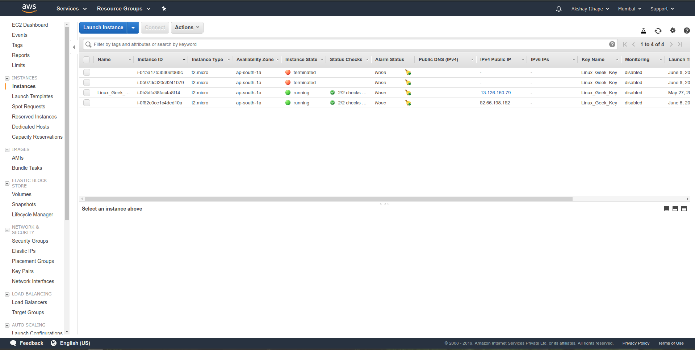
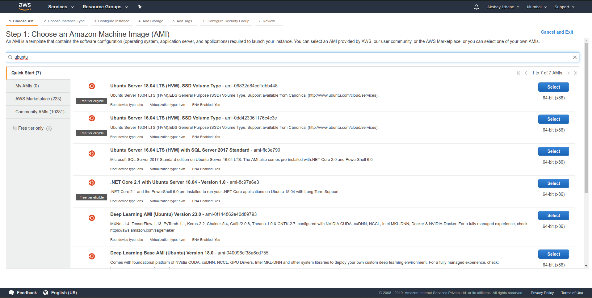
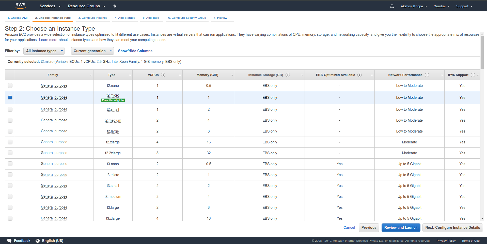
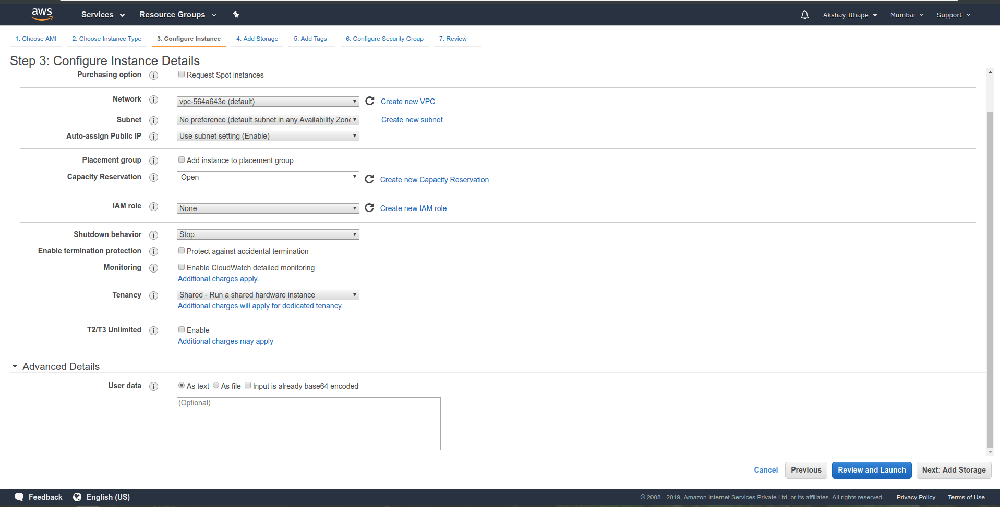
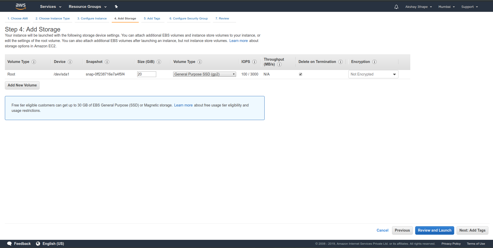
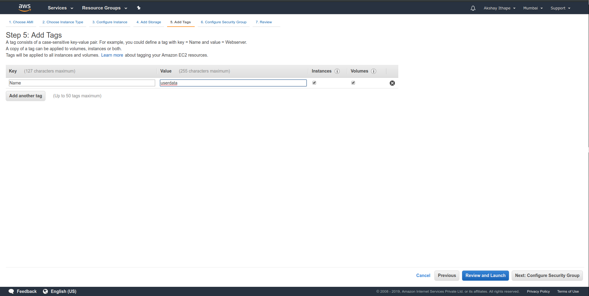
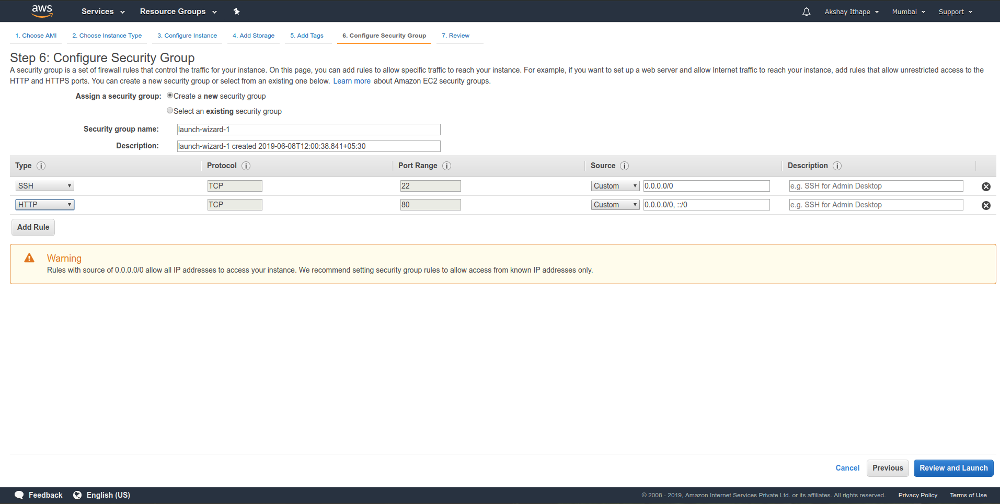
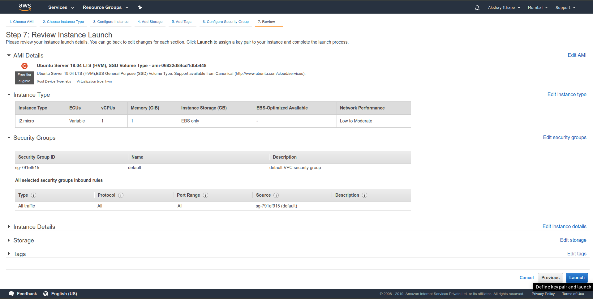
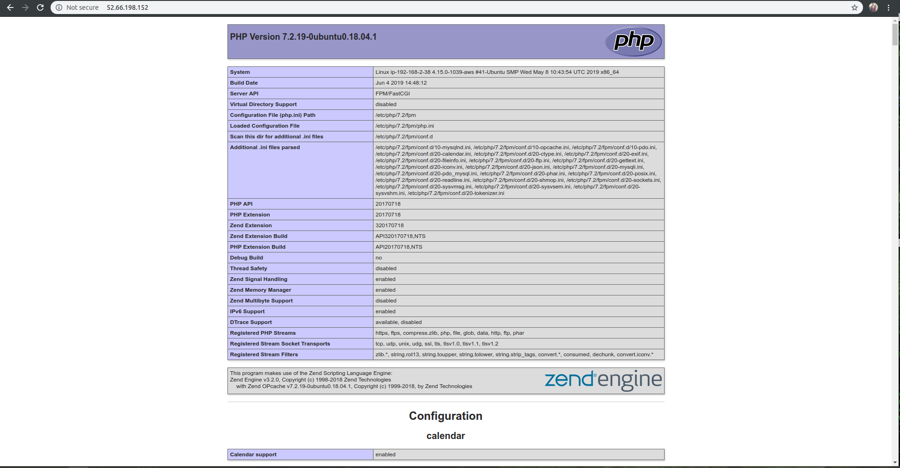

# Launching EC2 With Userdata Parameter
In this lab section we are going to launch EC2 with userdata. First Userdata is one of the configuration parameter which we will be set during EC2 configuration. It is optional parameter for EC2 configuration. 

## What Is Userdata
In userdata you can define set of commands or data or any script which will be provide to a EC2 instance at launch time. By default, User data script and cloud-init directives run only during the boot cycle when you first launch an instance.

## Example Of Userdata
Consider the example, we want to install Nginx Server on EC2 instance at launch time. Simply we define nginx install commands in Userdata while configuring EC2 instance. Simply put following two lines in user data.
```
apt-get update
apt-get install nginx
```
when we launch EC2 instance in that instance nginx is installed.

## Use Of Userdata 
1. It will be use when you want to install some software without user interface at a time of EC2 launch.
2. It will be use when you want to execute any script(It may be shell or python) at a time of EC2 launch without user interface.
3. Simple it will use in automation deployments

## EC2 With Userdata Lab Section 
In this we are going to install LEMP(Linux,Nginx,Mysql,PHP) stack on EC2 instance using userdata

### Step 1 :- Go to the **EC2** service after that go to the **Instances** options



### Step 2 :- Click on  **Launch Instance** ,**Choose AMI** (Ubuntu), **Choose an Instance Type** (use only free tier) and click on **Configure Instance details**





### Step 3 :- After filling configuration details click on **Advanced Details** in that you got the **User data** section. In that section just put following shell script (this script is write for ubuntu only)



#### Shell Script Link Is Below
[Shell Script Link](https://github.com/akshayithape1252/Automation_Shell_Scripts/blob/master/shell_scripts/lemp_installation_for_ec2_userdata.sh)

### Step 4 :- Click on **Add Storage** and define size, After that click on **Add Tags** and define tages, After that click on **Configure Security Group** and make sure that you port no 80 will be open.







### Step 5 :- Click on **Review and Launch** after that finally click on **Launch** and configure your key.



### Step 6 :- Open **Web Brower** and put your instance public ip address



## And Its Done. Thank you everyone 

